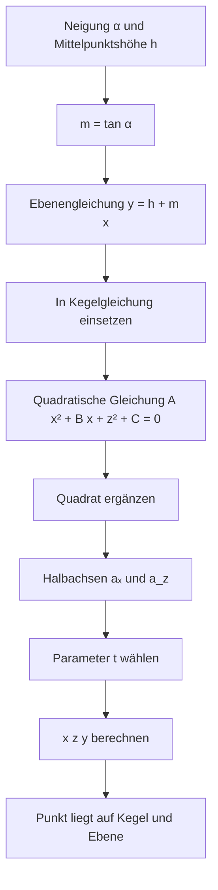

# Technische Dokumentation

Eine Browserfassung mit gesetzten LaTeX-Formeln ist unter
[TECHNICAL.html](TECHNICAL.html) verfügbar.

Die beiden Seiten sind `index.html` (Pyramiden und Navigation) und
`kegelschnitt_ellipse_begrenzt.html` (Kegelschnitt). Das eigenständige Projekt
Wortgeflecht ist ein eigenständiges Projekt unter `C:\Projekte\wortgeflecht`
und gehört nicht mehr zum Quellbaum dieses Pyramiden-Projekts.
Sie verwenden native ES-Module
ohne Build-Schritt. Zum lokalen Öffnen ist ein HTTP-Server erforderlich:

```sh
npm ci
npm start
```

Danach sind alle Seiten unter `http://127.0.0.1:4173/` erreichbar.
Three.js bleibt in allen Importmaps auf Version **0.180.0** festgelegt.
Die öffentliche Darstellung lädt Three.js weiterhin von jsDelivr.

### Aufbau

- `pyramids/` und `ellipse/`: jeweils `config.js` für Vorgaben,
  `geometry.js` für Berechnungen, `model.js` für Three.js-Objekte,
  `status.js` für die Template-Anzeige und `main.js` für Zustand und DOM-Ereignisse.
- `shared/`: gemeinsame Ansicht mit Orbit-Steuerung, Kameraeinrahmung,
  rekursive Ressourcenfreigabe und Template-Bindung.
- `styles/`: separate Stylesheets der beiden Seiten.
- HTML-Dateien: Seitenstruktur, deutsche Beschriftungen und Status-Templates.
  Es gibt vorerst keine Lokalisierung und keine Übersetzungsinfrastruktur.

Die Modellmodule erhalten ihre Szene explizit; Statusmodule erhalten Container
und Template. Berechnungen greifen nicht auf das DOM zu. Beim Neuaufbau werden
alte Geometrien und Materialien einschließlich verschachtelter Kanten freigegeben.
Die maximale Schnitthöhe wird bei steilen Ebenen auch unterhalb der ursprünglichen
Reglermindesthöhe begrenzt, damit die Ellipse vollständig auf dem endlichen Kegel liegt.
Die gemeinsame Kameraeinrahmung hält auch den Kegel in schmalen Ansichten vollständig sichtbar.

Die Pyramidenhöhen `hq` und `ht` reichen bis 100. Die Werte werden mit beliebiger
Schrittweite übernommen, damit das exakte Zusammenführen nicht durch einen groben
Reglerschritt verfälscht wird. `Spitzen zusammenführen` berechnet aus Zielspitze,
Dreiecksgrundtiefe und dem Versatz der Dreiecksspitze gleichzeitig die nötige Höhe
und den Klappwinkel; der Status zeigt danach `0.000` Abstand. `Flache Ausgangslage`
setzt beide Grundflächen auf Kantenlänge 5, den Klappwinkel auf 0° und die übrigen
Werte auf die definierte flache Ausgangskonfiguration zurück.

Die aktuelle Pyramiden-Ausgangslage ist so gewählt, dass tatsächlich jede Kante
beider Pyramiden Länge 5 besitzt. Dafür ist die quadratische Grundfläche (5\times5)
groß und ihre Höhe
\[
h_q=\sqrt{5^2-2\left(\frac52\right)^2}=\sqrt{\frac{25}{2}}\approx3{,}535534.
\]
Bei der Dreieckspyramide ist `dt` die senkrechte Koordinate des dritten
Grundpunktes, nicht direkt eine Kantenlänge. Die drei Grundkanten werden 5 mit
\[
d_t=\sqrt{5^2-\left(\frac52\right)^2}=\sqrt{\frac{75}{4}}\approx4{,}330127.
\]
Die gleiche Kantenlänge für die Dreieckspitze ergibt daraus
\[
h_t=\sqrt{5^2-\frac49d_t^2}=\sqrt{\frac{50}{3}}\approx4{,}082483.
\]
Die Kanten bleiben über die Regler veränderbar; diese Werte sind nur die Startwerte.

### Kegelschnitt: Herleitung der Ellipse

Die Berechnung in `ellipse/geometry.js` verwendet keine nachträgliche Annäherung
an den Kegelmantel. Jeder Kurvenpunkt wird direkt aus derselben Kegelgleichung und
Ebenengleichung berechnet. Die mathematische Notation hier ist LaTeX/KaTeX-
Schreibweise; auf GitHub wird sie in geeigneten Ansichten als Formel gerendert,
andernfalls bleibt die Formel als gut lesbarer Quelltext sichtbar.

Der Ablauf lässt sich zusätzlich so lesen:



#### 1. Kegel und Schnittebene

Für die feste Kegelgeometrie gilt mit Höhe (H=5), Radius (R=3) und
(k=R/H=3/5=0{,}6):

$$
x^2+z^2=k^2y^2.
$$

Die Schnittebene hat Mittelpunktshöhe (h) und Neigung α. Im Code wird zuerst

$$
m=\tan(\alpha)
$$

berechnet. Damit lautet die Ebene:

$$
y=h+mx.
$$

Die Ebene steigt also in positiver x-Richtung um (m) Einheiten pro y-Einheit.

#### 2. Ebene in den Kegel einsetzen

Wir ersetzen in der Kegelgleichung jedes (y) durch (h+mx):

$$
x^2+z^2=k^2(h+mx)^2.
$$

Das Quadrat wird ausmultipliziert:

$$
(h+mx)^2=h^2+2hmx+m^2x^2.
$$

Einsetzen und Ausmultiplizieren der rechten Seite ergibt:

$$
x^2+z^2=k^2h^2+2k^2hmx+k^2m^2x^2.
$$

Alle Terme werden auf die linke Seite gebracht:

$$
(1-k^2m^2)x^2-2k^2hmx+z^2-k^2h^2=0.
$$

Der Code nennt die drei Koeffizienten:

$$
A=1-k^2m^2,\qquad B=-2k^2hm,\qquad C=-k^2h^2.
$$

Damit ist die Schnittgleichung exakt:

$$
Ax^2+Bx+z^2+C=0.
$$

Ist (A\le 0), ist der Schnitt in diesem Modell keine geschlossene Ellipse;
`ellipseSection` gibt dann `null` zurück. Für (A>0) geht es mit dem Ergänzen
des Quadrats weiter.

#### 3. Quadrat ergänzen

Zuerst werden die x-Terme isoliert:

$$
Ax^2+Bx=-z^2-C.
$$

Durch (A) teilen:

$$
x^2+\frac{B}{A}x=-\frac{z^2+C}{A}.
$$

Der passende Ergänzungsterm ist

$$
\left(\frac{B}{2A}\right)^2.
$$

Auf beiden Seiten addiert und links als Binom geschrieben:

$$
\left(x+\frac{B}{2A}\right)^2
=\frac{B^2}{4A^2}-\frac{z^2+C}{A}.
$$

Multiplikation mit (A) liefert die für den Code bequeme Form:

$$
A\left(x+\frac{B}{2A}\right)^2+z^2
=\frac{B^2}{4A}-C.
$$

Wir definieren nun den Mittelpunkt und die rechte Seite:

$$
x_c=-\frac{B}{2A},\qquad
Q=\frac{B^2}{4A}-C.
$$

Dann lautet die Gleichung:

$$
A(x-x_c)^2+z^2=Q.
$$

Division durch (Q) bringt die Standardform der Ellipse:

$$
\frac{(x-x_c)^2}{Q/A}+\frac{z^2}{Q}=1.
$$

Die Halbachsen sind deshalb:

$$
a_x=\sqrt{\frac{Q}{A}},\qquad a_z=\sqrt{Q}.
$$

Genau diese Werte berechnet der Code als `ax` und `az`.

#### 4. Einen Punkt der Ellipse parametrisieren

Für einen Parameter (t\in[0,2\pi)) setzen wir:

$$
x(t)=x_c+a_x\cos(t),\qquad z(t)=a_z\sin(t).
$$

Die y-Koordinate kommt anschließend direkt aus der Ebene:

$$
y(t)=h+m\,x(t).
$$

Der dreidimensionale Punkt ist somit:

$$
P(t)=\bigl(x_c+a_x\cos(t),\;
h+m(x_c+a_x\cos(t)),\;
a_z\sin(t)\bigr).
$$

Der Rendercode verwendet 360 gleichmäßig verteilte Werte
(t_i=2\pi i/360). Dadurch entsteht eine geschlossene `THREE.LineLoop`.

#### 5. Konkretes Zahlenbeispiel

Für die Standardwerte (α=38^\circ) und (h=2{,}8) gilt:

$$
m=\tan(38^\circ)\approx0{,}781286,
\qquad k=0{,}6.
$$

Damit entstehen:

$$
A\approx0{,}780253,
\qquad B\approx-1{,}575072,
\qquad C=-2{,}8224,
$$

$$
x_c\approx1{,}009334,
\qquad Q\approx3{,}617286,
$$

$$
a_x\approx2{,}153147,
\qquad a_z\approx1{,}901917.
$$

Nehmen wir (t=\pi/3), also (cos(t)=1/2) und
(sin(t)=\sqrt3/2):

$$
x\approx1{,}009334+2{,}153147\cdot0{,}5
\approx2{,}085907,
$$

$$
z\approx1{,}901917\cdot\frac{\sqrt3}{2}
\approx1{,}647108,
$$

$$
y=2{,}8+0{,}781286\cdot2{,}085907
\approx4{,}429689.
$$

Der resultierende Punkt lautet also ungefähr:

$$
P(\pi/3)\approx(2{,}085907,\;4{,}429689,\;1{,}647108).
$$

Kontrolle der beiden ursprünglichen Gleichungen:

$$
y-h-mx\approx0,
$$

$$
x^2+z^2\approx7{,}063972
\quad\text{und}\quad
k^2y^2\approx7{,}063972.
$$

Der Punkt liegt damit gleichzeitig auf der Ebene und auf dem Kegelmantel.

### Prüfungen

```sh
npm test
npm run check
npx playwright install chromium
npm run test:browser
npm run format:check
```

Die Unit-Tests prüfen Exportverträge, Berechnungen, Grenzfälle, Kameraeinrahmung
und Ressourcenfreigabe sowie Normalisierung, Kettenbildung und Federverhalten.
Die Browsertests laden alle Einstiegsmodule bei Desktop-
und Mobilgröße, sammeln `pageerror`-Ereignisse und prüfen Regler, Moduswechsel,
Reset, Animation, DOM-Templates, Wortknoten-Ziehen, Tastaturbedienung und Layoutgeometrie. Screenshots entstehen unter
`test-results/`. Für reproduzierbare Tests werden ausschließlich die CDN-Anfragen
für Three.js auf die lokal installierte identische Version umgeleitet; die
Erreichbarkeit des öffentlichen CDN wird damit nicht getestet.

Optional kann `PLAYWRIGHT_CHROMIUM_EXECUTABLE` auf ein bereits installiertes
Chromium-Testprogramm zeigen. Die produktiven Seiten benötigen weder Node.js noch
die Testabhängigkeiten. Bei einer Veröffentlichung müssen die HTML-Dateien und
alle referenzierten Modul- und CSS-Verzeichnisse zusammen hochgeladen werden.
